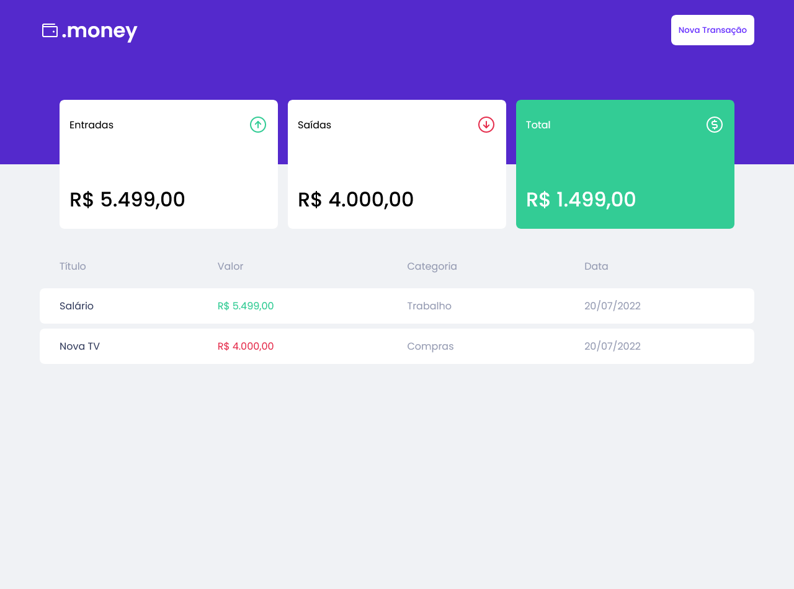

# :tw-1f4b5: dot.money 



> Projeto de uma carteira de saldo, que soma as entradas e saídas cadastradas na interface. Desenvolvido no módulo de React do Ignite da Rocketseat.


## 💻 Tecnologias e Libs Utilizadas

* React
* Typescript
* Styled Components
* Axios
* Miragejs
* Phosphor React Icons
* React Modal
* Polished


## 🚀 Instalando e Utilizando

Para instalar o `<dot.money>` , faça um fork e siga as etapas:

Para que as dependências sejam instaladas:

```
<npm install>
```

Logo depois, rode: 

```
<npm run dev>
```

E acesse:

```
<http://localhost:3000/>
```

[⬆ Voltar ao topo](#nome-do-projeto)<br>
